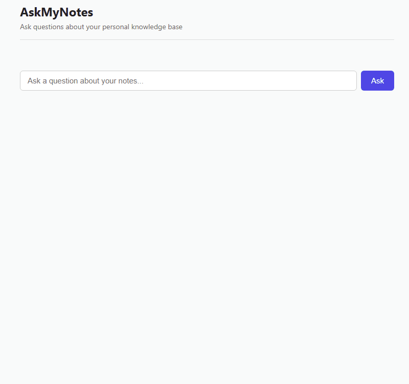
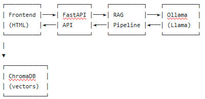

# AskMyNotes

A local RAG-powered Q&A system for your personal notes. Ask questions about
your documents in plain English, get grounded answers with source citations.
Runs entirely on your machine — no cloud LLM costs, no data leaving your device.



## What it does

Feed AskMyNotes any collection of markdown, text, or PDF documents. Ask
questions about them through a web interface. Get concise, sourced answers
generated by a local language model — with the exact chunks that informed
each answer shown alongside.

## Why I built it

I wanted to (a) build a real full-stack AI application end-to-end, and
(b) learn what actually happens inside RAG systems rather than treat them
as a black box. Every piece — chunking, embeddings, vector search, prompt
engineering, API design — is written from primitives rather than pulled from
a high-level framework.

## Architecture



**Ingestion path:** documents are loaded, split into overlapping chunks,
embedded using sentence-transformers, and stored in ChromaDB with source
metadata.

**Query path:** the user's question is embedded with the same model,
ChromaDB returns the top-k most similar chunks, and those chunks are
included in a carefully-engineered prompt sent to a local Llama model
via Ollama.

## Stack

- **LLM runtime:** Ollama (Llama 3.2 3B by default)
- **Embeddings:** sentence-transformers (all-MiniLM-L6-v2, 384-dim)
- **Vector store:** ChromaDB (local, persistent)
- **API:** FastAPI + Pydantic
- **Frontend:** vanilla HTML/CSS/JS (no framework)
- **Package management:** uv

## Features

- Local-first: no data leaves your machine
- Sourced answers: every answer cites the chunks used
- Graceful "I don't know" when the context doesn't cover the question
- Distance-thresholded retrieval to filter out irrelevant chunks
- Auto-generated interactive API docs at `/docs`
- Warm-loaded models via FastAPI lifespan events

## Setup

### Prerequisites

- Python 3.11+
- [uv](https://github.com/astral-sh/uv) for dependency management
- [Ollama](https://ollama.com/download) installed and running

### Install

```bash
git clone https://github.com/yourusername/askmynotes.git
cd askmynotes
uv sync
ollama pull llama3.2
```

### Add your notes

Drop `.md`, `.txt`, or `.pdf` files into the `data/` directory.

### Ingest

```bash
uv run python src/ingest.py --reset
```

### Run

```bash
uv run uvicorn src.api:app --reload
```

Open [http://127.0.0.1:8000/](http://127.0.0.1:8000/) in your browser.

## Usage

- **Chat UI:** ask questions at [http://127.0.0.1:8000/](http://127.0.0.1:8000/)
- **API docs:** interactive Swagger UI at [http://127.0.0.1:8000/docs](http://127.0.0.1:8000/docs)
- **Upload documents:** POST to `/ingest` with a file, or drop files into
  `data/` and rerun the ingestion script

## Known limitations

- The default 3B model sometimes ignores the "answer only from context" rule
  for questions it has strong training-data priors on. Larger models (llama3.1:8b)
  follow the instruction more reliably at the cost of speed
- Chunking is character-based; token-based recursive chunking would be more
  robust for varied document types
- No conversation memory between questions
- Single user, no authentication or rate limiting
- Distance threshold is hand-tuned rather than derived from an evaluation set

## What I'd do next

- Streaming responses (token-by-token like ChatGPT)
- Evaluation harness: 30 held-out Q&A pairs to track quality changes across
  chunking, retrieval, and prompt changes
- Metadata filters to scope questions to specific document folders
- Docker Compose for one-command setup including Ollama

## License

MIT